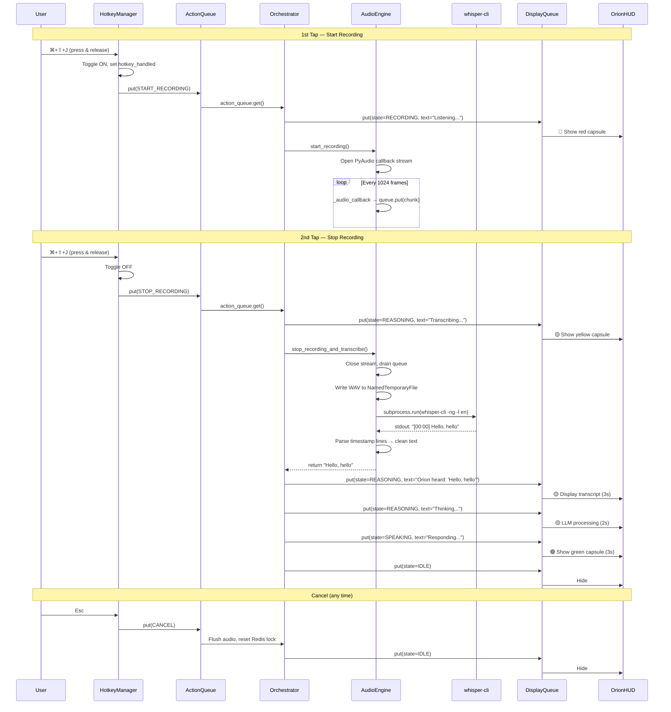

# Orion Client HUD

A native macOS overlay HUD and voice input system for the Orion assistant. Runs directly on the host OS (outside Docker) to access the microphone, global hotkeys, and native window compositing.

## Architecture

```
client_hud/
├── src/
│   ├── hotkey_manager.py   # Global hotkey listener (pynput)
│   ├── audio_engine.py     # Microphone capture + STT (whisper-cli)
│   └── orion_hud.py        # Translucent overlay UI (PyQt6)
├── pyproject.toml           # Dependencies & build config
└── README.md
```

The HUD is orchestrated by `orchestrator/orchestrator_v3.py`, which sits outside this module and bridges the hotkey events, audio pipeline, and UI state machine.

---

## Components

### 1. `HotkeyManager` — Global Hotkey Listener

**File:** `src/hotkey_manager.py`  
**Library:** `pynput`

Captures system-wide keyboard events via the macOS Accessibility API without requiring focus on the application window.

| Property | Value |
|---|---|
| Hotkey | `⌘ + ⇧ + J` |
| Mode | **Toggle** — 1st tap starts recording, 2nd tap stops |
| Thread Model | Daemon thread (non-blocking) |
| Output | `queue.Queue` injection of `START_RECORDING`, `STOP_RECORDING`, or `CANCEL` actions |

**Key Design Decisions:**
- **Toggle over Push-to-Talk:** Holding `⌘+⇧+J` triggers macOS "sticky key" error sounds due to the unbound modifier combination. Toggling avoids the OS key-repeat loop entirely.
- **Debounce Guard:** A `hotkey_handled` flag prevents a single physical keypress from registering multiple times via OS key-repeat.
- **Escape Cancellation:** Pressing `Esc` at any time injects a `CANCEL` action, flushing the audio buffer and resetting all state.

**Classes:**
- `HotkeyAction` — String enum for action types
- `HotkeyManager` — Listener lifecycle and key state tracking

---

### 2. `AudioEngine` — Microphone Capture & Speech-to-Text

**File:** `src/audio_engine.py`  
**Libraries:** `PyAudio`, `whisper-cli` (Homebrew), `wave`, `tempfile`

Manages the full audio pipeline: microphone capture via callback, WAV encoding, and transcription via the native `whisper-cli` binary.

| Property | Value |
|---|---|
| Sample Rate | 16,000 Hz |
| Channels | Mono |
| Bit Depth | 16-bit signed integer (`paInt16`) |
| Chunk Size | 1024 frames |
| STT Engine | `/usr/local/bin/whisper-cli` (Homebrew `whisper-cpp` 1.8.4) |
| STT Model | `ggml-base.en.bin` (~147 MB) |
| GPU | **Disabled** (`-ng` flag) |

**Audio Capture Flow:**
1. `start_recording()` opens a PyAudio stream in **callback mode**
2. `_audio_callback()` pushes raw byte chunks into a thread-safe `queue.Queue`
3. `stop_recording_and_transcribe()` drains the queue, encodes to WAV via `tempfile.NamedTemporaryFile`, and shells out to `whisper-cli`

**STT Invocation:**
```bash
whisper-cli -m <model_path> -f <tmp.wav> -l en -ng
```
- `-l en` — Force English language detection
- `-ng` — CPU-only inference (see GPU Note below)

**Key Design Decisions:**
- **Subprocess over Python bindings:** The `pywhispercpp` Python library routes inference through Apple's Metal GPU API. On Intel Macs with discrete AMD Radeon GPUs, this corrupts `float16` tensor math inside GGML, causing Whisper to hallucinate repeating garbage (e.g., `"in in in"`, `"™™™™"`). The Homebrew-compiled `whisper-cli` binary with `-ng` forces pure CPU/BLAS inference, which transcribes perfectly.
- **Temp file over stdin pipe:** `whisper-cli` uses `drwav` internally, which requires `seek()` on WAV headers. Unix pipes (`/dev/stdin`) are not seekable, so a `NamedTemporaryFile` is used instead. It auto-deletes when the `with` block exits.
- **Callback mode over blocking read:** Ensures audio capture never blocks the orchestrator thread.

---

### 3. `OrionHUD` — Translucent Overlay UI

**File:** `src/orion_hud.py`  
**Library:** `PyQt6`

A frameless, always-on-top, translucent capsule rendered at the bottom-center of the primary display. Communicates with the orchestrator via a `display_queue`.

| Property | Value |
|---|---|
| Framework | PyQt6 (Qt 6.6+) |
| Window Flags | `WindowStaysOnTopHint`, `FramelessWindowHint` |
| Transparency | `WA_TranslucentBackground` |
| Position | Bottom-center, 100px from screen edge |
| Size | 600 × 100px |
| Poll Rate | 50ms (20 FPS) |

**Visual States:**

| State | Color | Text Color | Description |
|---|---|---|---|
| `RECORDING` | 🔴 Red (`rgba(200,40,40,0.9)`) | White | Microphone is active |
| `REASONING` | 🟡 Yellow (`rgba(200,150,40,0.95)`) | Black | Transcribing / LLM processing |
| `SPEAKING` | 🟢 Green (`rgba(40,180,80,0.9)`) | White | TTS playback / response |
| `ERROR` | 🔴 Bright Red (`rgba(255,0,0,1.0)`) | White | System busy or failure |
| `IDLE` | — | — | Hidden |

**Key Design Decisions:**
- **Main thread only:** macOS requires all window management on the main thread. The PyQt6 event loop (`app.exec()`) runs on the main thread; everything else is dispatched to daemon threads.
- **`raise_()` on every state change:** Ensures the HUD stays above all other windows, including fullscreen apps. Without this, macOS Mission Control can bury the overlay.
- **No `Qt.WindowType.Tool` flag:** On macOS, the `Tool` flag causes non-app-bundled Python scripts to be treated as invisible background daemons.
- **Signal-based updates:** `pyqtSignal` bridges the thread-safe `queue.Queue` to Qt's main-thread-only widget updates.

---

## Sequence Diagram



---

## Dependencies

| Package | Purpose |
|---|---|
| `PyQt6 >=6.6.0` | Native macOS overlay window |
| `pyaudio >=0.2.14` | Microphone capture (requires `portaudio`) |
| `pynput >=1.7.6` | Global hotkey listener |
| `redis >=5.0.3` | State locking (optional, graceful offline) |

**System dependencies (Homebrew):**
```bash
brew install portaudio whisper-cpp cmake
```

**STT Model** is auto-downloaded to `~/Library/Application Support/pywhispercpp/models/` on first run via `pywhispercpp` (retained even though inference now uses `whisper-cli`).

---

## macOS Permissions Required

| Permission | Location | Why |
|---|---|---|
| **Accessibility** | System Settings → Privacy & Security → Accessibility | Required for `pynput` to intercept global keystrokes |
| **Microphone** | System Settings → Privacy & Security → Microphone | Required for `PyAudio` to capture audio input |

> ⚠️ If Accessibility is not granted, `pynput` will log a warning and silently fail to detect hotkeys. If Microphone is not granted, PyAudio will stream zeroed-out silent buffers, causing Whisper to hallucinate.

---

## Running

```bash
cd client_hud
uv run python ../orchestrator/orchestrator_v3.py
```
