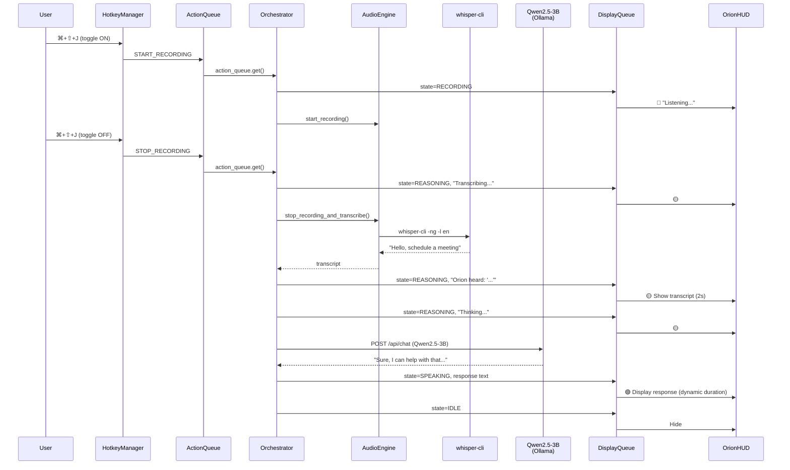

# Orion Orchestrator

The central brain that bridges the macOS client HUD (hotkeys, mic, overlay) with the LLM inference layer. Runs as a daemon thread behind the PyQt6 UI, consuming hotkey actions and coordinating the full voice-assistant pipeline.

## Architecture

```
orchestrator/
└── orchestrator_v3.py   # Main entry point — daemon + PyQt6 launcher
```

The orchestrator imports directly from `client_hud/src/` and is launched from within the `client_hud` virtual environment.

---

## Components

### `orchestrator_daemon` — Event Loop & Pipeline Controller

Runs on a background daemon thread, polling the `action_queue` for hotkey events and orchestrating the pipeline:

```
⌘+⇧+J (start) → Mic capture → ⌘+⇧+J (stop) → Whisper STT → Qwen2.5 LLM → HUD display
```

| State | HUD Color | What's Happening |
|---|---|---|
| `RECORDING` | 🔴 Red | Microphone is capturing audio |
| `REASONING` (transcribing) | 🟡 Yellow | `whisper-cli` is converting speech to text |
| `REASONING` (thinking) | 🟡 Yellow | Qwen2.5-3B is generating a response via Ollama |
| `SPEAKING` | 🟢 Green | LLM response displayed on HUD |
| `IDLE` | — | Hidden |

### `query_llm` — Ollama / Qwen2.5-3B Client

Sends transcribed text to Qwen2.5-3B running locally via Ollama's REST API. Maintains a rolling 20-message conversation history for multi-turn context.

| Property | Value |
|---|---|
| Model | `qwen2.5:3b` (configurable via `OLLAMA_MODEL`) |
| Endpoint | `http://localhost:11434/api/chat` |
| Timeout | 60 seconds |
| Max Output Tokens | 256 (tuned for voice-assistant brevity) |
| Temperature | 0.7 |
| Context Window | Last 20 messages (rolling) |

**Error Handling:** Graceful fallback messages for connection errors, timeouts, HTTP errors, and malformed responses — the HUD always shows *something* rather than crashing.

---

## Sequence Diagram



---

## Environment Variables

| Variable | Default | Description |
|---|---|---|
| `OLLAMA_URL` | `http://localhost:11434` | Ollama server base URL |
| `OLLAMA_MODEL` | `qwen2.5:3b` | Model tag to use for inference |
| `OLLAMA_TIMEOUT` | `60` | Max seconds to wait for LLM response |

---

## Prerequisites

1. **Ollama** must be installed and running:
   ```bash
   brew install ollama
   ollama serve
   ollama pull qwen2.5:3b
   ```

2. **Redis** (optional, for busy-lock):
   ```bash
   brew services start redis
   ```

---

## Running

```bash
cd client_hud
uv run python ../orchestrator/orchestrator_v3.py
```

The orchestrator launches the PyQt6 HUD on the main thread and runs itself as a daemon thread. Press `⌘+⇧+J` to toggle recording, `Esc` to cancel.
