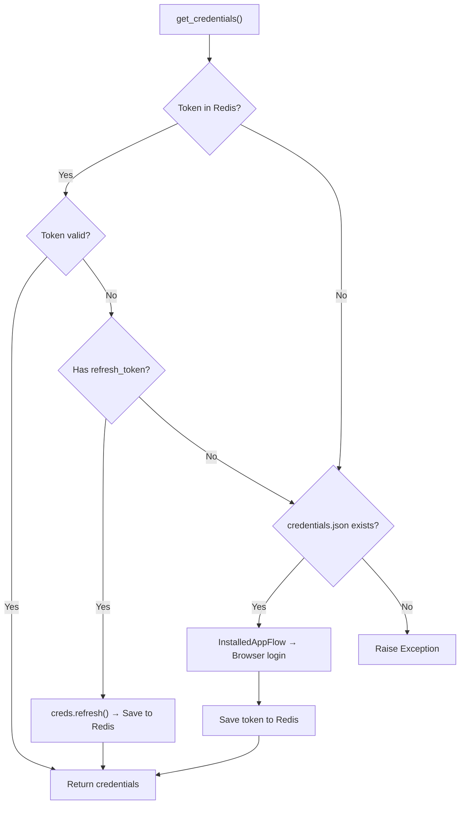
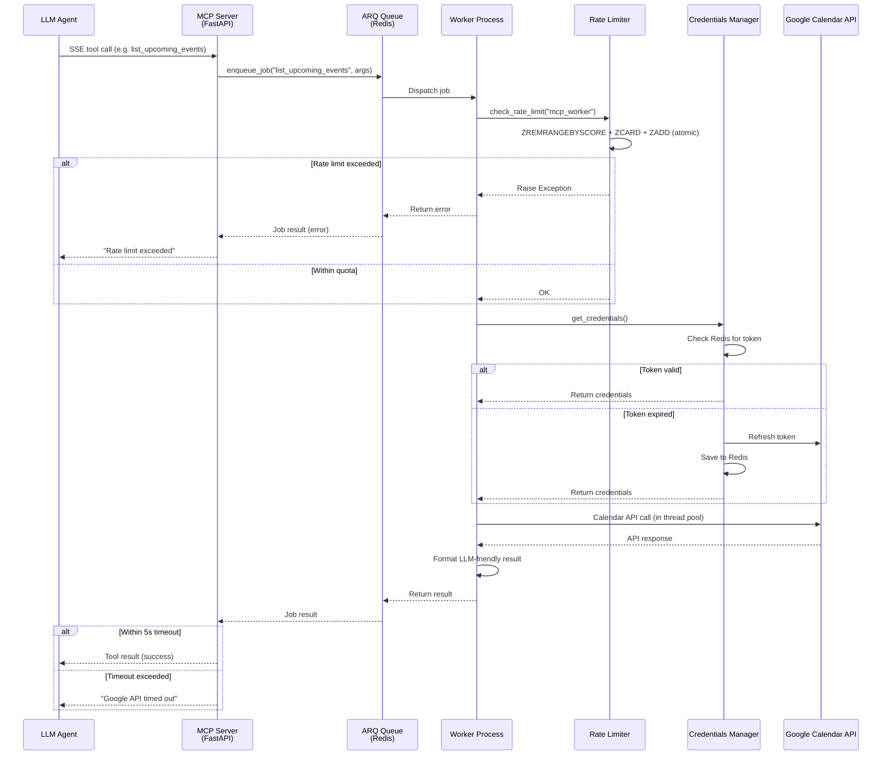

# Orion Google Calendar MCP Server

A containerized Model Context Protocol (MCP) server that bridges Google Calendar with LLM agents. Exposes calendar operations as MCP tools over SSE/HTTP, backed by an async Redis job queue for non-blocking Google API execution.

## Architecture

```
servers/google_calendar/
├── src/
│   ├── mcp_server.py          # FastAPI + FastMCP tool definitions
│   ├── redis_worker.py        # ARQ worker with Google Calendar API logic
│   ├── credentials_manager.py # OAuth2 token lifecycle (Redis-backed)
│   └── rate_limiter.py        # Sliding window rate limiter
├── tests/
│   └── test_server.py         # Unit tests (pytest + asyncio)
├── Dockerfile                 # Multi-stage Docker build (uv)
├── pyproject.toml             # Dependencies & build config
└── README.md
```

---

## Components

### 1. `mcp_server` — FastAPI + MCP Tool Registry

**File:** `src/mcp_server.py`  
**Libraries:** `FastAPI`, `FastMCP`, `arq`

The HTTP entry point. Registers MCP tools and delegates all work to the Redis-backed ARQ worker pool. No Google API calls happen in this process — it only enqueues jobs and awaits results.

| Property | Value |
|---|---|
| Framework | FastAPI (mounted on Uvicorn) |
| MCP Transport | SSE (Server-Sent Events) mounted at `/mcp` |
| Job Queue | ARQ (async Redis queue) |
| Timeout | 5 seconds per tool invocation (strict) |

**Exposed MCP Tools:**

| Tool | Parameters | Description |
|---|---|---|
| `list_upcoming_events` | `max_results: int = 5` | Fetch next N events from primary calendar |
| `create_event` | `summary, start_time, end_time, description` | Create a new calendar event (RFC3339 times) |
| `update_event` | `event_id, summary?, start_time?, end_time?` | Patch an existing event by ID |
| `check_conflicts` | `start_time, end_time` | Check for scheduling conflicts via FreeBusy API |

**Key Design Decisions:**
- **Worker delegation over inline calls:** All Google API calls run in a separate ARQ worker process. This prevents slow or failing API responses from blocking the MCP server's event loop.
- **5-second hard timeout:** If a worker job doesn't complete within 5 seconds, a timeout error is returned to the LLM rather than hanging indefinitely.
- **SSE transport:** FastMCP's `sse_app()` is mounted as a sub-application at `/mcp`, keeping the FastAPI root available for health checks or future REST endpoints.

---

### 2. `redis_worker` — ARQ Worker with Google Calendar API

**File:** `src/redis_worker.py`  
**Libraries:** `arq`, `google-api-python-client`

The actual execution layer. Each function receives a job context (`ctx`) from ARQ, authenticates via `credentials_manager`, checks the rate limiter, and makes synchronous Google API calls in a thread pool.

| Property | Value |
|---|---|
| Runtime | ARQ worker process (separate from MCP server) |
| API Client | `google-api-python-client` (Calendar v3) |
| Thread Model | `asyncio.to_thread()` wrapping sync Google API calls |
| Rate Limiting | Checked before every API call |

**Worker Functions:**

| Function | Google API | Returns |
|---|---|---|
| `list_upcoming_events` | `events().list()` | `[{id, summary, start, htmlLink}, ...]` |
| `create_event` | `events().insert()` | `{status, event_id, link}` |
| `update_event` | `events().get()` → `events().update()` | `{status, event_id, link}` |
| `check_conflicts` | `freebusy().query()` | `{conflict: bool, busy_slots?: [...]}` |

**Key Design Decisions:**
- **`asyncio.to_thread` wrapping:** The `google-api-python-client` is synchronous. Each API call is wrapped in `to_thread()` to avoid blocking the async event loop.
- **Fetch-then-patch for updates:** `update_event` first GETs the current event, applies partial updates, then PATCHes. This preserves fields the caller didn't specify.
- **LLM-friendly output:** Results are stripped down to essential fields (`id`, `summary`, `start`, `htmlLink`) rather than returning the full Google API response blob.

---

### 3. `credentials_manager` — OAuth2 Token Lifecycle

**File:** `src/credentials_manager.py`  
**Libraries:** `google-auth-oauthlib`, `redis.asyncio`

Manages the full OAuth2 lifecycle: token storage in Redis, automatic refresh on expiry, and interactive first-time authentication.

| Property | Value |
|---|---|
| Token Storage | Redis key `gcal:token` (JSON-serialized) |
| OAuth Scopes | `https://www.googleapis.com/auth/calendar` (full read/write) |
| Refresh | Automatic via `creds.refresh(Request())` when token expires |
| First-time Auth | `InstalledAppFlow.run_local_server()` (opens browser) |

**Token Resolution Flow:**



**Key Design Decisions:**
- **Redis over file-based token storage:** Tokens are stored in Redis (`gcal:token`) rather than `token.json` on disk. This enables stateless container deployments and shared token access across replicas.
- **Graceful refresh:** Expired tokens are silently refreshed without user interaction as long as a refresh token exists.
- **Container caveat:** First-time OAuth requires a browser redirect (`run_local_server`), which won't work inside a headless container. The initial auth must be performed on the host, after which the token persists in Redis.

---

### 4. `rate_limiter` — Sliding Window Rate Limiter

**File:** `src/rate_limiter.py`  
**Libraries:** `redis.asyncio`

Implements a sliding window rate limiter using Redis sorted sets to prevent exceeding Google Calendar API quotas.

| Property | Value |
|---|---|
| Algorithm | Sliding window (Redis sorted set) |
| Default Limit | **10 requests per 10 seconds** per client |
| Scope | Per-client ID (defaults to `"global"`) |
| Storage | Redis sorted set at `rate_limit:{client_id}` |

**How It Works:**
1. Remove entries older than the window (`ZREMRANGEBYSCORE`)
2. Count remaining entries (`ZCARD`)
3. Add the current request with a unique nanosecond-precision key (`ZADD`)
4. Set TTL on the key to auto-clean idle windows (`EXPIRE`)
5. If count ≥ limit → raise `Exception`

All operations execute atomically inside a Redis `pipeline(transaction=True)`.

**Key Design Decisions:**
- **Sorted set over simple counter:** Sorted sets enable precise sliding windows rather than fixed windows, preventing burst-at-boundary edge cases.
- **Nanosecond-precision keys:** `str(time.time_ns())` ensures uniqueness even for sub-second bursts.
- **Pipeline transaction:** All four Redis commands execute atomically, preventing race conditions under concurrent load.

---

## Sequence Diagram



---

## Dependencies

| Package | Purpose |
|---|---|
| `fastapi >=0.111.0` | HTTP framework |
| `uvicorn >=0.29.0` | ASGI server |
| `redis >=5.0.0` | Async Redis client |
| `arq >=0.26.0` | Async Redis job queue |
| `google-api-python-client >=2.128.0` | Google Calendar API client |
| `google-auth-oauthlib >=1.2.0` | OAuth2 authentication flow |
| `google-auth-httplib2 >=0.2.0` | HTTP transport for google-auth |
| `mcp >=1.0.0` | Model Context Protocol SDK |
| `pydantic >=2.7.0` | Data validation |

**Dev dependencies:** `pytest`, `pytest-asyncio`, `httpx`

---

## Environment Variables

| Variable | Default | Description |
|---|---|---|
| `REDIS_URL` | `redis://localhost:6379/0` | Redis connection string for ARQ + token storage + rate limiting |
| `PYTHONPATH` | `/app/src` (in Docker) | Module resolution path |
| `PYTHONUNBUFFERED` | `1` (in Docker) | Force unbuffered stdout for log streaming |

---

## Running

### Docker (Production)

```bash
# Build
docker build -t orion-gcal-mcp .

# Run MCP server
docker run -p 8000:8000 -e REDIS_URL=redis://host.docker.internal:6379/0 orion-gcal-mcp

# Run ARQ worker (separate container/process)
docker run -e REDIS_URL=redis://host.docker.internal:6379/0 orion-gcal-mcp \
  python -m arq src.redis_worker.WorkerSettings
```

### Local Development

```bash
cd servers/google_calendar

# Install dependencies
uv sync

# Start MCP server
uv run uvicorn src.mcp_server:app --reload --port 8000

# Start ARQ worker (separate terminal)
uv run arq src.redis_worker.WorkerSettings
```

### First-Time OAuth Setup

1. Download `credentials.json` from the [Google Cloud Console](https://console.cloud.google.com/apis/credentials)
2. Place it in `servers/google_calendar/`
3. Run the server locally (not in Docker) — it will open a browser for OAuth consent
4. After authentication, the token is stored in Redis and persists across restarts

### Tests

```bash
uv run pytest tests/ -v
```
