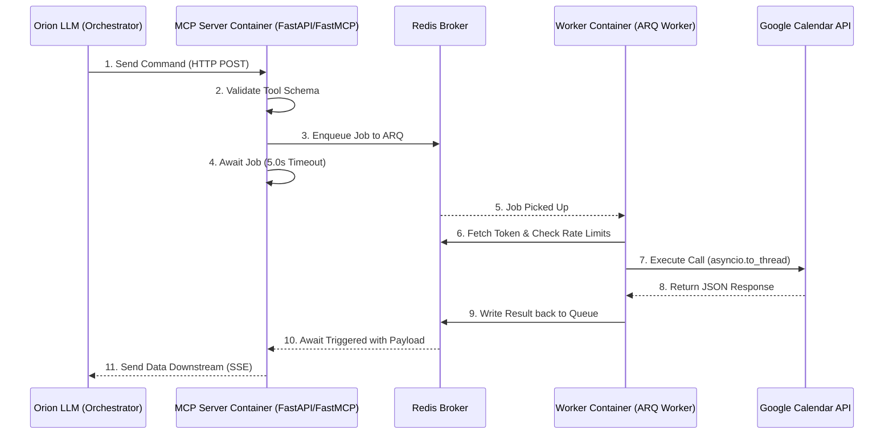

# Orion Google Calendar MCP Server

A FastMCP capability module designed for the Orion assistant framework. It leverages a fully decoupled architecture utilizing FastAPI, Redis, and ARQ to achieve high-concurrency, asynchronous, and LLM-optimized Google Calendar integrations.

---

## 🏛️ Architecture Breakdown



Because LLM assistants require high-speed context responses and Google API bounds can be slow or synchronous, this service specifically separates the API interface from the execution interface. 

The architecture consists of the following key components:

### 1. `mcp_server.py` (The Interface)
The frontend "toll booth" of the application. It attaches the `FastMCP` specification natively inside a lightweight `FastAPI` instance. 
- Exposes strict JSON schemas for the Orion LLM to parse (e.g. `list_upcoming_events`, `create_event`).
- **Timeout Logic**: Operations in this layer do NOT execute API calls. Once a request hits, it enqueues a background job into Redis and strictly `awaits` it with a maximum `5.0` second timeout. If Google APIs hang, it instantly cancels the await and returns a structured failure message to the LLM agent.

### 2. `redis_worker.py` (The Executor)
The heavy-lifter separated from the API container. Powered by the lightweight `arq` queue framework.
- Polls Redis for jobs submitted by the `mcp_server.py`.
- Because the standard Google SDK utilizes native blocking Python operations, the worker wraps all logic inside `asyncio.to_thread` executors. This prevents the worker event loop from ever freezing, allowing massive concurrent processing without CPU spikes.

### 3. `rate_limiter.py` (The Governor)
Integrates a "Leaky Bucket / Sliding Window" protocol directly within Redis.
- Stores rolling timestamp metrics across 10-second sliding windows via Redis `ZSET` structures.
- Triggers exceptions immediately if the agent starts "hallucinating" and hammering outbound API pipelines, thereby preventing your Google Cloud credentials from being restricted by 429 errors.

### 4. `credentials_manager.py` (The Shared State)
Manages the Google API OAuth 2.0 implementation.
- Normally, Google stores OAuth profiles inside a local `token.json` file. Because this architecture is isolated using Docker, `credentials_manager.py` persists the exact JSON state to Redis (`gcal:token`).
- When tokens are passively generated or automatically refreshed inside the Worker container, the API server container gets immediate access to the synchronized tokens, eliminating local auth fragmentation.

---

## 🐳 Deployment

Designed for native orchestration using uv-optimized Docker footprints.

```bash
cd ../../
docker compose up --build -d
```
All capabilities will immediately broadcast over `http://127.0.0.1:8000/mcp/sse`.
